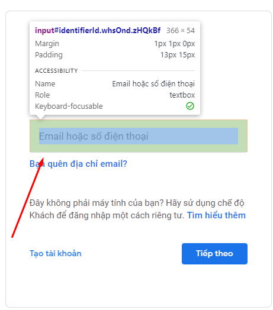

# AUTOMATION USER MANUAL

Automation is a feature that helps you automate everything with just a few commands. It is suitable for repetitive or repetitive work processes with a large number of profiles such as register account, raise account, auto like, plow YouTube views, auto search to increase SEO,... and is created by articles created according to your ideas called scripts. Below is a complete tutorial on the Automation feature.

Tự động hóa là tính năng giúp bạn tự động hóa mọi thứ chỉ bằng một vài lệnh. Nó phù hợp với những quy trình làm việc lặp đi lặp lại hoặc lặp đi lặp lại với số lượng lớn hồ sơ như đăng ký tài khoản, tăng tài khoản, auto like, cày view Youtube, auto search để tăng SEO,... và được tạo bởi các bài viết được tạo theo ý tưởng của bạn gọi là kịch bản. Dưới đây là hướng dẫn đầy đủ về tính năng Tự động hóa.

<figure><figcaption>
This is the main working screen of automation.
</figcaption></figure>

&#x20;But before you want to work with automation, you need to know how to can select element because It is necessary for most nodes to utilize it. You can open random URL and after that, click mouse right and click here :&#x20;

Nhưng trước khi muốn làm việc với tự động hóa, bạn cần biết cách chọn phần tử vì hầu hết các nút đều cần sử dụng nó. Bạn có thể mở URL ngẫu nhiên và sau đó, nhấp chuột phải và nhấp vào đây: 

<figure><figcaption></figcaption></figure>

And choose exact element you want put in script like this :&#x20;

Và chọn phần tử chính xác mà bạn muốn đưa vào tập lệnh như thế này:

<figure><figcaption></figcaption></figure>

After that, you can see the blue lines in right tab like this :&#x20;

Sau đó, bạn có thể thấy các đường màu xanh lam ở tab bên phải như thế này:

<figure><figcaption></figcaption></figure>

Continue clicking copy selector or copy xpath or full xpath. Normally you can copy selector but sometimes you have to copy full xpath, you can search when should I use either of them. If you have some understanding of inspect commands, selecting elements is easier without copying.

Tiếp tục nhấp vào copy selector or copy xpath or full xpath. Thông thường bạn có thể copy selector nhưng đôi khi bạn phải sao chép copy full xpath, bạn có thể tìm kiếm khi nào tôi nên sử dụng một trong hai bộ chọn đó. Nếu bạn có chút hiểu biết về cách lấy các phần tử một cách chính xác, việc chọn các phần tử sẽ dễ dàng hơn mà không cần sao chép.

Mỗi tập lệnh sẽ tương đương với một chu trình làm việc, trong các tập lệnh chứa “node” và luôn có hai trường hợp cho một node : đỏ và xanh. Màu xanh lá cây là những gì bạn đặt chính xác và nó tiếp tục thực hiện các hành động trên các node khác, trong khi màu đỏ là không chính xác. Đối với một số thành phần, bạn phải thực hiện cả xanh và đỏ:

<figure><figcaption></figcaption></figure>
