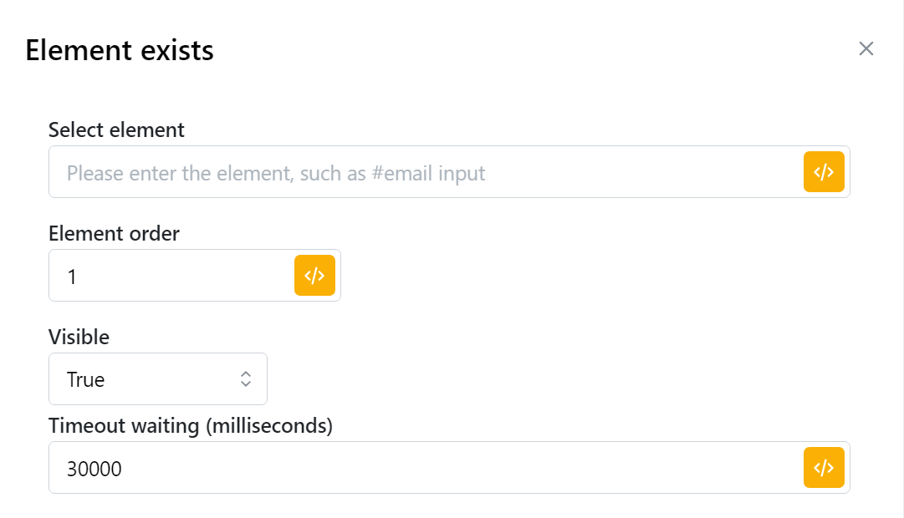

# Element exists

* This function allows you to check whether the element you select exists or not. If it does not exist, you must have another node direction for it or the script is stopped here, but if it exists, it continues to follow direction you want. To verify whether a particular element exists, you have two options: you can either copy its selector or enter its formula in the designated box below. For example, if you need to check whether your email has an inbox button, this feature will help you determine its presence. If the button is missing, you can return to the login page and sign in again. If it's present, you can proceed to read your messages. When using this node, you must determine if two cases exist or not in order to create a professional script.\
  \
  Chức năng này cho phép bạn kiểm tra xem phần tử bạn chọn có tồn tại hay không. Nếu nó không tồn tại, bạn phải có hướng nút khác cho nó hoặc tập lệnh sẽ dừng ở đây, nhưng nếu nó tồn tại, nó sẽ tiếp tục đi theo hướng bạn muốn. Để xác minh xem một phần tử cụ thể có tồn tại hay không, bạn có hai tùy chọn: bạn có thể sao chép bộ chọn của nó hoặc nhập công thức của nó vào hộp được chỉ định bên dưới. Ví dụ: nếu bạn cần kiểm tra xem email của mình có nút hộp thư đến hay không, tính năng này sẽ giúp bạn xác định sự hiện diện của nó. Nếu thiếu nút, bạn có thể quay lại trang đăng nhập và đăng nhập lại. Nếu nó hiện diện, bạn có thể tiếp tục đọc tin nhắn của mình. Khi sử dụng nút này, bạn phải xác định xem có tồn tại hai trường hợp hay không để tạo tập lệnh chuyên nghiệp.

<figure><figcaption></figcaption></figure>

| parameter       | illustrate                                                                                                                                                             |
| --------------- | ---------------------------------------------------------------------------------------------------------------------------------------------------------------------- |
| Select element  | Nhập CSS selector, chẳng hạn như #email, #global-enhancements-search-query                                                                                             |
| Element order   | Chọn thành phần nào của trong web                                                                                                                                      |
| Visible         | Khi chọn Visible (True hoặc False), nghĩa là bước tiếp theo sẽ chỉ được thực hiện khi thành phần trang web (hình ảnh/nút/tùy chọn, v.v.) được hiển thị trên trang web. |
| Timeout waiting | Thời gian chờ đợi tối đa. Ví dụ: 30000: Nếu bước này không được thực hiện thành công trong vòng 30 giây thì bước tiếp theo sẽ được thực hiện trực tiếp.                |


