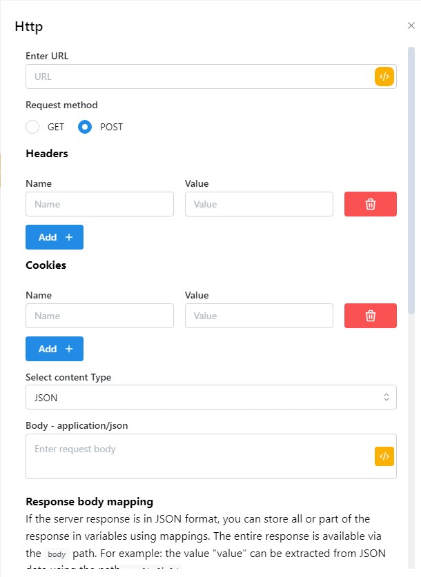

# HTTP

&#x20;This node can be challenging, especially for those with limited knowledge of HTTP. However, having a good understanding of HTTP will make it easier to use. In essence, this HTTP sends requests to the API using either the GET or POST method and displays the response in the tabs below.\
\
Node này có thể là một node khó, đặc biệt đối với những người có kiến ​​thức hạn chế về HTTP. Tuy nhiên, hiểu rõ về HTTP sẽ giúp sử dụng dễ dàng hơn. Về bản chất, HTTP này gửi yêu cầu tới API bằng phương thức GET hoặc POST và hiển thị phản hồi trong các tab bên dưới.


<figure><figcaption></figcaption></figure>

* Enter URL: Địa chỉ URL yêu cầu
* Phương thức yêu cầu: GET, POST
* Headers:[ **Header**](https://developer.mozilla.org/en-US/docs/Web/HTTP/Headers) được yêu cầu
* Cookies:  [**HTTP cookies**](https://developer.mozilla.org/en-US/docs/Web/HTTP/Cookies)
* Select content Type: Chọn loại nội dung của bạn.
* Response body mapping: Phản hồi của yêu cầu

1. Ví dụ 1:  [**API**](https://docs.hidemium.io/use-cases/api-automation/get-profile/4.-list-tag) có response như sau:

```json
[
    {
        "value": 132,
        "label": "tag 1"
    },
    {
        "value": 136,
        "label": "tag 2"
    },
    {
        "value": 137,
        "label": "tag 3"
    },
    {
        "value": 138,
        "label": "tag 4"
    }
]
```

Để lấy được <mark style="color:blue;">`Value`</mark> của label tag 3 ta viết như sau: <mark style="color:blue;">`2.value`</mark>

<figure><figcaption></figcaption></figure>

2. ví dụ 2: Ta có đoạn response sau:

```json
{
    "status": "success",
    "data": [
        {
            "id": 7,
            "email": "michael.lawson@reqres.in",
            "first_name": "Michael",
            "last_name": "Lawson",
            "avatar": "https://reqres.in/img/faces/7-image.jpg"
        },
        {
            "id": 8,
            "email": "lindsay.ferguson@reqres.in",
            "first_name": "Lindsay",
            "last_name": "Ferguson",
            "avatar": "https://reqres.in/img/faces/8-image.jpg"
        },
        {
            "id": 9,
            "email": "tobias.funke@reqres.in",
            "first_name": "Tobias",
            "last_name": "Funke",
            "avatar": "https://reqres.in/img/faces/9-image.jpg"
        }
    ]
    }
}
```

Để lấy được <mark style="color:blue;">`email`</mark> của <mark style="color:blue;">"first\_name": "Michael"</mark> , ta viết <mark style="color:blue;">`data.0.email`</mark>



