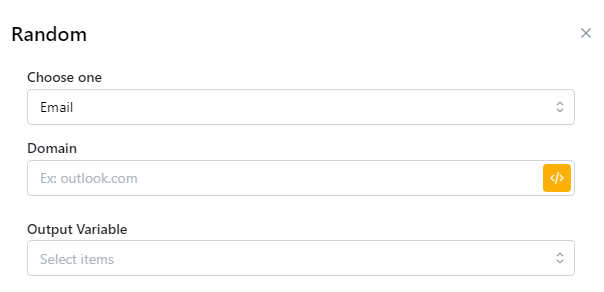

# Random

You can generate random values ​​for the variable of your choice.\
\
Bạn có thể tạo các giá trị ngẫu nhiên cho biến bạn chọn.

<figure><figcaption></figcaption></figure>

| parameter                                                                              | illustrate                                                      |
| -------------------------------------------------------------------------------------- | --------------------------------------------------------------- |
| Choose one: Email, Full name, Random Letters, Password, First name, Last name, Number. | Chọn một trường bạn muốn lấy giá trị ngẫu nhiên.                |
| Email: Domain                                                                          | Đặt tên miền cho Domain                                         |
| Select symbols quantity                                                                | Chọn số lượng ký tự                                             |
| Output Variable                                                                        | Lưu các phần tử được trích xuất dưới dạng biến và nhập tên biến |


