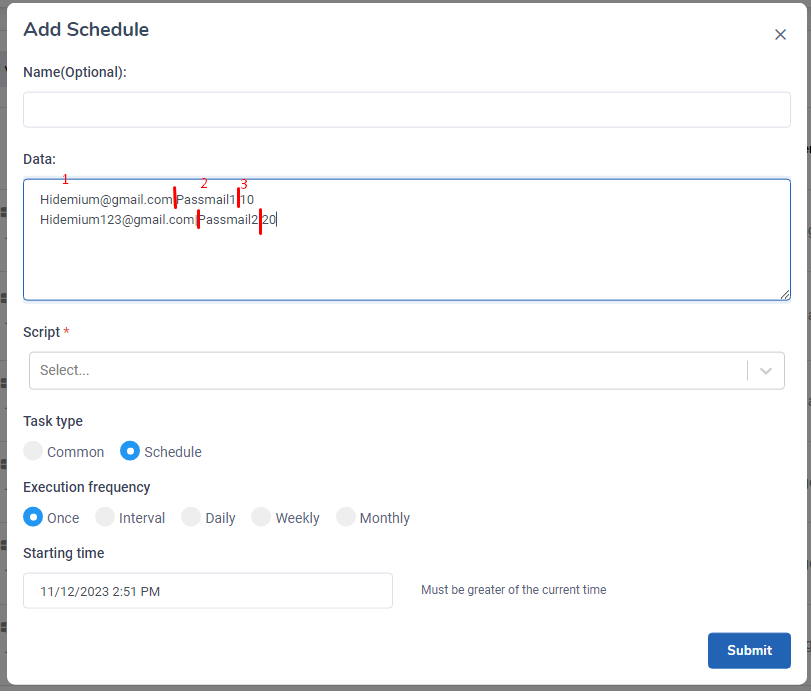
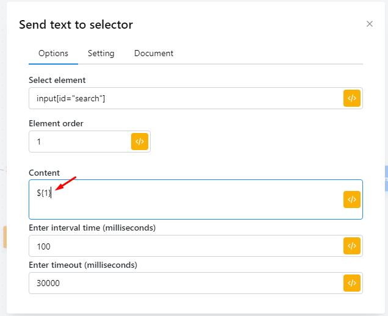
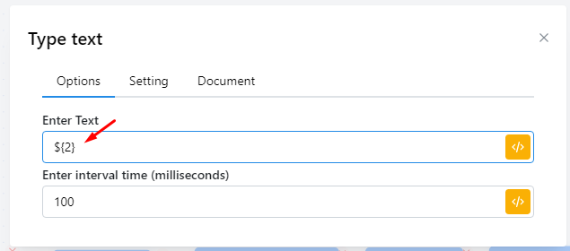
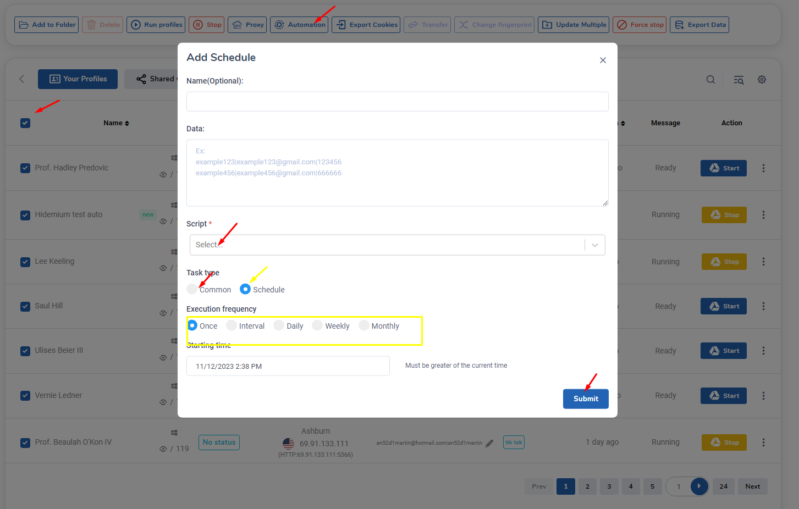
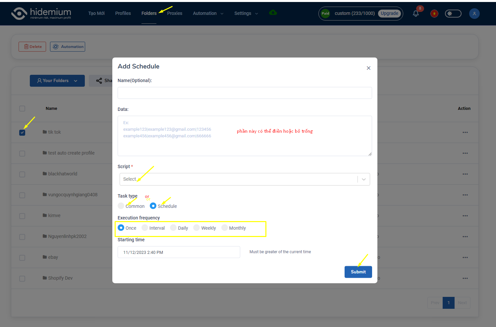
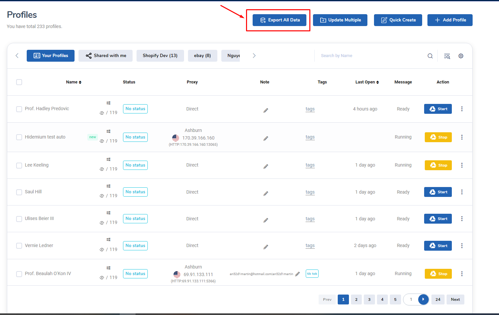

# How to start script auto ?

I. Cách Sử Dụng ô " Data" trong " Add Schedule"

<figure><figcaption></figcaption></figure>

Như màn hình hiện tại thì mọi người có thể  thấy các nội dung khi viết theo format " Hidemium@gmail.com|passmail1|10 hệ thống tự hiểu vị trí của nội dung đó theo số thứ tự lần lượt 1 2 3 4 và được cách nhau bằng ký tự đặc biệt "|". Mỗi dòng là đại diện cho một profile. Phần data này sẽ dùng trong script dưới dạng biến như sau :&#x20;

<figure><figcaption></figcaption></figure>

 

<figure><figcaption></figcaption></figure>

Chính vì hệ thống tự hiểu thứ tự vị trí của từng nội dung nên trong script chỗ nào bạn cần sử dụng nội dung đó thì chỉ cần điền format của biến là **${}** và số thứ tự của nội dung đó ngoài bảng Data như 2 ảnh trên. Ví dụ node Send text kia phần content điền **${1}** thì khi bắt đấu chạy script b điền vào ô Data " **Hidemium@gmail.com|passmail1** thì script sẽ nhận dữ liệu của **${1}** là **Hidemium@gmail.com**. Tương tự node Type Text điền **${2}** thì dữ liệu script nhận được sẽ là **passmail1.**&#x20;

Có một lưu ý khi sử dụng tính năng này là người dùng phải tự tính toán được vị trí của dữ liệu mình muốn truyền vào trước để viết hoàn chỉnh trong script rồi sau đó khi mỗi lần chạy thì chỉ cần nhập data ở bảng " Data" là được.&#x20;

## II. Các cách có thể run script auto với các profile.

Trước hết Hidemium sẽ giải thích cho bạn cách dùng màn " Add Schedule" này nhé :

<figure><figcaption></figcaption></figure>

**Name:** Điền name của Schedule, bạn có thể bỏ trống trường này.

**Script:** Chọn script để chạy

**Task type:** Có 2 loại chính đó là Common và Schedule. Với common thì profile sẽ được chạy ngay sau lúc tạo. Còn Schedule bạn có thể đặt lịch chạy của các profiles với script bạn chọn.

Với Schedule bạn có thể chọn Execution frequency:

* Once: Chạy 1 lần trong ngày. bạn có thể chọn ngày và giờ chạy.

<figure><figcaption></figcaption></figure>

* Interval: Chạy trong khoảng thời gian từ start time đến end time. Bạn cần nhập Each time delay, trường này bạn cần nhập khoảng thời gian delay giữa các lần chạy. Ví dụ bạn nhập là 5 thì khi chạy xong một lần 5 phút sau mới chạy lần thứ 2, cứ thế cho đến hết end time.

<figure><figcaption></figcaption></figure>

<figure><figcaption></figcaption></figure>

* Daily: Chạy hằng ngày. Ở đấy bạn cần chọn Execution time là thời gian chạy script trong khoảng từ start time đến end time.&#x20;

<figure><figcaption></figcaption></figure>

* Weekly: Chạy hàng tuần. Tại Execution time bạn có thể chọn thứ để chạy và giờ chạy. Và chọn thời gian bắt đầu và thời gian kết thúc.

<figure><figcaption></figcaption></figure>

* Monthly: Chạy hàng tháng. Bạn có thể chọn ngày và giờ để chạy, chọn thời gian bắt đầu và thời gian kêt thúc. Ví dụ bạn chọn ngày 13 thì đến ngày 13 và đến giờ thì sẽ chạy profile.

<figure><figcaption></figcaption></figure>

### 1. Cách chạy auto với màn Profile

Giới thiệu với mọi người cách chạy auto đầu tiên cũng dễ nhất là chọn profile ở màn Profile và làm theo các hướng dẫn như ảnh dưới đây

<figure><figcaption></figcaption></figure>

Phần data mọi người có thể bỏ trống nếu như không có gì. Hoặc dùng theo hướng dẫn ở mục **I**

### 2. Chạy auto với folder.

Tương tự như chọn profile để chạy thì mọi người có thể chọn folder nhé.

<figure><figcaption></figcaption></figure>

### 3. Chạy auto với list profile

Để sử dụng được tính năng này thì trước tiên mọi người cần có được list UUID của những profile mà mọi người muốn chạy. Thì đây là cách để lấy được UUID của tất cả profile :

<figure><figcaption>
Click vào export all data
</figcaption></figure>

Sau đó làm từng bước như ảnh dưới đây là được nhé. Phần Name mọi người có thể đặt tên cho campaign hoặc Hidemium sẽ lấy tên script làm tên campaign luôn. UUID sẽ điền vào ô " Data"

<figure><figcaption></figcaption></figure>

