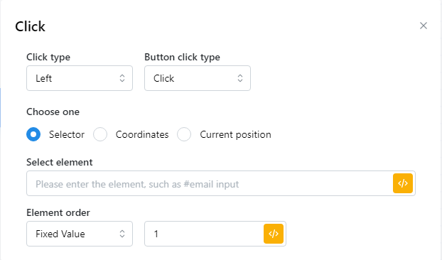

# Click

True to its name, this button is used to automatically click the mouse on the element you select and put it in the "select element" box. In addition, it also has the option of left or right mouse click, middle click, click or double click and select by Selector or Coordinates or Current positon\
\
Đúng như tên gọi của nó, nút này dùng để tự động click chuột vào phần tử bạn chọn và cho vào ô “select element”. Ngoài ra nó còn có tùy chọn click chuột trái hoặc phải, click giữa, click hoặc click đúp và chọn bằng Selector hoặc Tọa độ hoặc Vị trí hiện tại.

<figure><figcaption></figcaption></figure>

| parameter         | illustrate                                                                                                                                                           |
| ----------------- | -------------------------------------------------------------------------------------------------------------------------------------------------------------------- |
| Click type        | 
Left: click chuột trái Right: click chuột phải Midle: click giữa
                                                                                        |
| Button click type | 
Click Double click: click đúp
                                                                                                                              |
| Selector          | Click chuột vào phần tử bạn chọn                                                                                                                                     |
| Select element    | Nhập CSS selector, chẳng hạn như #email, #global-enhancements-search-query                                                                                           |
| Element order     | 
Chọn thành phần nào của trang web Fixed value: Giá trị cố định Random value: giá trị ngẫu nhiên, bạn có thể random giá trị trong khoảng giá trị bạn đặt
 |
| Coordinates       | 
Click vào tọa độ bạn chọn

Enter X coordinate: Nhập tọa độ X

Enter Y coordinate: Nhập tọa độ Y
                                                     |
| Current position  | Vị trí hiện tại                                                                                                                                                      |


