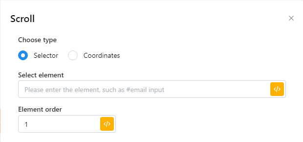

# Scroll

It is intended for users who wish to scroll the page to simulate an action or locate the next element they wish to manipulate by selecting an element or by coordinates and you need to determine the coordinates of that location.\
\
Nó dành cho người dùng muốn cuộn trang để mô phỏng một hành động hoặc xác định vị trí phần tử tiếp theo mà họ muốn thao tác bằng cách chọn một phần tử hoặc theo tọa độ và bạn cần xác định tọa độ của vị trí đó

<figure><figcaption></figcaption></figure>

| parameter      | illustrate                                                                                                                                                   |
| -------------- | ------------------------------------------------------------------------------------------------------------------------------------------------------------ |
| Select element | Nhập CSS selector của phần tử mà bạn muốn cuộn trang xuống                                                                                                   |
| Element order  | Chọn cố định một phần tử mà bạn muốn cuộn xuống                                                                                                              |
| Coordinates    | Nhập khoảng cách mà bạn muốn cuộn xuống và x,y chẳng hạn như nhập X=200, y=1000 , có nghĩa là bạn muốn cuộn sang phải 200 pixel, cuộn xuống dưới 1000 pixel  |


