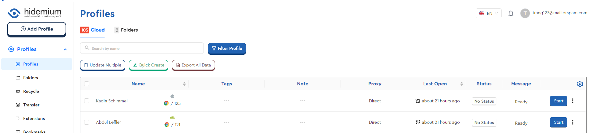

# Active tab

Nếu profile của bạn có nhiều tab, và bạn muốn chuyển đổi tab trang web, bạn có thể sử dụng node active tab này.

<figure><figcaption></figcaption></figure>

Ví dụ ta có 3 tab như sau:

<figure><figcaption></figcaption></figure>

* URL:

&#x20;           Equal: Nhập đường dẫn tuyệt đối của trang web, ví dụ: https://www.facebook.com/

&#x20;           Contain: Nhập đường dẫn tương đối của trang web, ví dụ : facebook

* Title:

&#x20;            Equal: Nhập tiêu đề tuyệt đối của trang web, ví dụ: Electronics, Cars, Fashion, Collectibles & More | eBay

&#x20;            Contain: Nhập tiêu đề tương đối của trang web, ví dụ: Facebook


