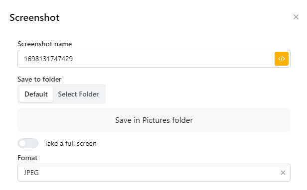

# Screenshot

<figure><figcaption></figcaption></figure>

| parameter                     | illustrate                                                                                       |
| ----------------------------- | ------------------------------------------------------------------------------------------------ |
| Screenshot name               | Bạn có thể nhập tên của ảnh chuoj màn hình hoặc sử dụng tên có sẵn của node                      |
| Save to folder: Default       | Tự động lưu ảnh vào folder Pictures của máy bạn.                                                 |
| Save to folder: Select Folder | Chọn nơi lưu ảnh                                                                                 |
| Chụp toàn màn hình            | 
ON: Chụp toàn bộ trang web

OFF: Chụp phần đang hiển thị trên màn hình của trang web
 |
| Format                        | Chọn định dạng của ảnh đầu ra là png hoặc jpeg.                                                  |


