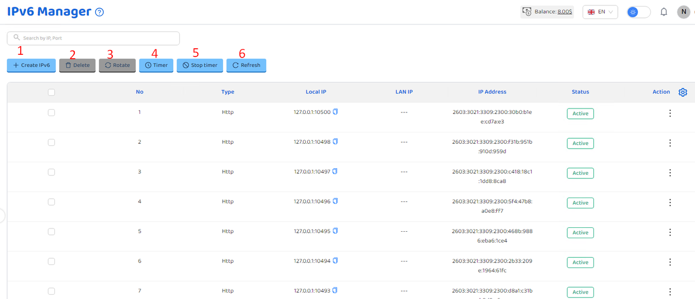

# Run other script

<figure><figcaption></figcaption></figure>

| parameter            | illustrate                                   |
| -------------------- | -------------------------------------------- |
| Script to be execute | Chọn script có sẵn, chỉ được chọn một script |
