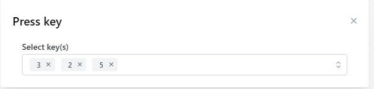

# AUTOMATION

Automation is a feature that helps you automate everything with just a few commands. It is suitable for repetitive or repetitive work processes with a large number of profiles such as register account, raise account, auto like, plow YouTube views, auto search to increase SEO,... and is created by articles created according to your ideas called scripts. Below is a complete tutorial on the Automation feature.

Tự động hóa là tính năng giúp bạn tự động hóa mọi thứ chỉ bằng một vài lệnh. Nó phù hợp với những quy trình làm việc lặp đi lặp lại hoặc lặp đi lặp lại với số lượng lớn hồ sơ như đăng ký tài khoản, tăng tài khoản, auto like, cày view Youtube, auto search để tăng SEO,... và được tạo bởi các bài viết được tạo theo ý tưởng của bạn gọi là kịch bản. Dưới đây là hướng dẫn đầy đủ về tính năng Tự động hóa.

<figure><figcaption>
This is the main working screen of automation.
</figcaption></figure>

&#x20;But before you want to work with automation, you need to know how to can select element because It is necessary for most nodes to utilize it. You can open random URL and after that, click mouse right and click here :&#x20;

Nhưng trước khi muốn làm việc với tự động hóa, bạn cần biết cách chọn phần tử vì hầu hết các nút đều cần sử dụng nó. Bạn có thể mở URL ngẫu nhiên và sau đó, nhấp chuột phải và nhấp vào đây:\

<figure><figcaption></figcaption></figure>

And choose exact element you want put in script like this :&#x20;

Và chọn phần tử chính xác mà bạn muốn đưa vào tập lệnh như thế này:

<figure><figcaption></figcaption></figure>

After that, you can see the blue lines in right tab like this :&#x20;

Sau đó, bạn có thể thấy các đường màu xanh lam ở tab bên phải như thế này:

<figure><figcaption></figcaption></figure>

Continue clicking copy selector or copy xpath or full xpath. Normally you can copy selector but sometimes you have to copy full xpath, you can search when should I use either of them. If you have some understanding of inspect commands, selecting elements is easier without copying.

Tiếp tục nhấp vào copy selector or copy xpath or full xpath. Thông thường bạn có thể copy selector nhưng đôi khi bạn phải sao chép copy full xpath, bạn có thể tìm kiếm khi nào tôi nên sử dụng một trong hai bộ chọn đó. Nếu bạn có chút hiểu biết về cách lấy các phần tử một cách chính xác, việc chọn các phần tử sẽ dễ dàng hơn mà không cần sao chép.

## SCRIPT

&#x20;Each script will be equivalent to one work cycle, in scripts containing "node" and there are always two cases for a node: red and green. Green is what you put in correctly and it continues to perform actions on other nodes, while red is incorrect. For some elements, you have to do both green and red :&#x20;

Mỗi tập lệnh sẽ tương đương với một chu trình làm việc, trong các tập lệnh chứa “node” và luôn có hai trường hợp cho một node : đỏ và xanh. Màu xanh lá cây là những gì bạn đặt chính xác và nó tiếp tục thực hiện các hành động trên các node khác, trong khi màu đỏ là không chính xác. Đối với một số thành phần, bạn phải thực hiện cả xanh và đỏ:

<figure><figcaption></figcaption></figure>

&#x20;             _<mark style="color:red;">in scripts use milliseconds and 1000 milliseconds = 1 second</mark>_ &#x20;

1. <mark style="color:red;">**Navigation**</mark><mark style="color:red;">:</mark> Nodes serve navigation actions ( Các nút phục vụ các hành động điều hướng )

* **New tab**: when you use this node, the script will open a new tab to take the next action starts with URL you put in  &#x20;

Khi bạn sử dụng nút này, tập lệnh sẽ mở một tab mới để thực hiện hành động tiếp theo bắt đầu bằng URL bạn nhập.

<figure><figcaption></figcaption></figure>

* **Active tab:** if your profile starts with so many tabs so you can select the tab you want by title or URL and equal or contain some information you provide here

&#x20;\
Nếu hồ sơ của bạn bắt đầu với rất nhiều tab để bạn có thể chọn tab bạn muốn theo tiêu đề hoặc URL và bằng hoặc chứa một số thông tin bạn cung cấp tại đây

<figure><figcaption></figcaption></figure>

* **Close tab:** You can choose to close the current tab or select a tab, if you select tab you need to type tab number.\
  \
  Bạn có thể chọn đóng tab hiện tại hoặc chọn tab, nếu chọn tab bạn cần gõ số tab.

<figure><figcaption></figcaption></figure>

* **Reload page :** You can use it when you want the script to reload the page and set timeout waiting\
  \
  Bạn có thể sử dụng nó khi bạn muốn script  tải lại trang và đặt thời gian chờ.

<figure><figcaption></figcaption></figure>

* **Switch Frame:** Some pages have iframe and you have to use node Switch Frame to navigate. You have two choices Sub frame and main frame. If you choose a subframe you need to select the element of that frame and here you also set the timeout waiting. When you use other platform accounts to log into a platform, you may come across a situation like this: when you log into Tik Tok with a Google account, a new tab will appear outside the main tab to log in to your account. To control this sub-tab using a script, you need to use the Switch Frame node.\
  \
  Một số trang có iframe và bạn phải sử dụng nút Switch Frame để điều hướng. Bạn có hai lựa chọn Khung phụ và khung chính. Nếu chọn khung con bạn cần chọn element  của khung đó và ở đây bạn cũng đặt thời gian chờ. Giống như việc bạn đăng nhập vào một nền tảng thông qua các tài khoản nền tảng khác sẽ gặp trường hợp như thế này, VD: đăng nhập tik tok bằng tài khoản google thì nó sẽ hiện ra một tab ngoài tab chính để đăng nhập account google. Lúc này nếu muốn script điều khiển được tab phụ kia thì cần dùng node Switch Frame này.

<figure><figcaption></figcaption></figure>

* **Open url :** You just need to put URL you want here and set the timeout waiting \
  \
  Bạn chỉ cần đặt URL bạn muốn vào đây và đặt thời gian chờ.

<figure><figcaption></figcaption></figure>

* **Screenshot :** You can take a Screenshot you want when opening some URL or page and save to a folder you create in your PC. \
  \
  Bạn có thể chụp Ảnh màn hình bạn muốn khi mở một số URL hoặc trang và lưu vào thư mục bạn tạo trên PC.

<figure><figcaption></figcaption></figure>

2. <mark style="color:red;">**Mouse**</mark>

* **Click  :** True to its name, this button is used to automatically click the mouse on the element you select and put it in the "select element" box. In addition, it also has the option of left or right mouse click, middle click, click or double click and select by Selector or Coordinates\
  \
  Đúng như tên gọi của nó, nút này dùng để tự động click chuột vào phần tử bạn chọn và cho vào ô “select element”. Ngoài ra nó còn có tùy chọn click chuột trái hoặc phải, click giữa, click hoặc click đúp và chọn bằng Selector hoặc Tọa độ

<figure><figcaption></figcaption></figure>

* **Scroll :** It is intended for users who wish to scroll the page to simulate an action or locate the next element they wish to manipulate by selecting an element or by coordinates and you need to determine the coordinates of that location.\
  \
  Nó dành cho người dùng muốn cuộn trang để mô phỏng một hành động hoặc xác định vị trí phần tử tiếp theo mà họ muốn thao tác bằng cách chọn một phần tử hoặc theo tọa độ và bạn cần xác định tọa độ của vị trí đó

<figure><figcaption></figcaption></figure>

* **Mouse movement :** And you put the element you want to move mouse there.\
  \
  Và bạn đặt phần tử bạn muốn di chuyển chuột vào đó.

<figure><figcaption></figcaption></figure>

* **Drop-down selector :** This Node is utilized when you need to choose a specific value given by people, such as selecting a date or month. Simply click on the desired value and a list of options will appear, such as selecting October 7th. You put an element into " select element" and type the value ( exemple : If you want to select July, enter the number 7 or you can import variables and choose to fill them based on them by clicking the orange button. )  you want in to " selected value".\
  \
  Nút này được sử dụng khi bạn cần chọn một giá trị cụ thể do mọi người đưa ra, chẳng hạn như chọn ngày hoặc tháng. Chỉ cần nhấp vào giá trị mong muốn và một danh sách các tùy chọn sẽ xuất hiện, chẳng hạn như chọn ngày 7 tháng 10. Bạn đặt một phần tử vào "select element" và gõ giá trị (ví dụ: Nếu bạn muốn chọn Tháng 7, hãy nhập số 7 hoặc bạn có thể nhập các biến và chọn điền chúng dựa trên chúng bằng cách nhấp vào nút màu cam.) bạn muốn. thành "selected value".

<figure><figcaption></figcaption></figure>

* **Mouse wheel :** This node simulates the mouse wheel to scroll the page. You need to enter the X and Y coordinates for the mouse wheel to reach that point.\
  \
  Node này mô phỏng thanh lăn chuột để cuộn trang. Bạn cần điền tọa độ X và Y để thanh lăn chuột đi tới điểm đó.

<figure><figcaption></figcaption></figure>

3. &#x20;<mark style="color:red;">**Keyboard**</mark>

* **Press key :**  This node allows you to select the desired key for the script to enter, similar to a keyboard.\
  \
  Nút này cho phép bạn chọn phím mong muốn để nhập tập lệnh, tương tự như bàn phím.

<figure><figcaption></figcaption></figure>

* **Type text :** If you want the script to enter some text, you can pre-write it or choose a variable you include. For example, if you have a file, when you encounter a google search section, you will enter those words one by one, profile 1 fill in Hidemium, profile 2 fill in download Hidemium, etc. Or click on the orange button and it will let you choose the variables you entered in the node "read file" section that I will introduce below. \
  \
  Nếu bạn muốn tập lệnh nhập một số văn bản, bạn có thể viết trước văn bản đó hoặc chọn một biến bạn đưa vào. Ví dụ: bạn có file, khi gặp mục tìm kiếm trên google, bạn sẽ nhập từng từ đó một, hồ sơ 1 điền Hidemium, hồ sơ 2 điền tải Hidemium, v.v. Hoặc bấm vào nút màu cam và nó sẽ cho phép bạn chọn các biến bạn đã nhập trong phần nút "đọc tệp" mà tôi sẽ giới thiệu bên dưới.

<figure><figcaption></figcaption></figure>

* **Send text to selector :** The user can perform two actions simultaneously with this node. Click on the input box you want to send a piece of text to, such as email, password, or keyword, and refer to it as select element. And we talked above about how to get the correct selector. After, we need to enter a single content on one line; Please enter multiple content in a new line, and one of content will be random selected. Example :&#x20;

&#x20;    Content one

&#x20;    Content two

Or click on the orange button and it will let you choose the variables you entered in the node "read file" section that I will introduce below. \
\
Người dùng có thể thực hiện đồng thời hai hành động với nút này. Nhấp vào hộp nhập mà bạn muốn gửi một đoạn văn bản tới, chẳng hạn như email, mật khẩu hoặc từ khóa và coi nó là phần tử chọn. Và chúng ta đã nói ở trên về cách lấy bộ chọn chính xác. Sau đó, chúng ta cần nhập một nội dung trên một dòng; Vui lòng nhập nhiều nội dung vào một dòng mới và một trong các nội dung sẽ được chọn ngẫu nhiên. Ví dụ :&#x20;

&#x20;Nội dung một&#x20;

Nội dung hai&#x20;

Hoặc nhấp vào nút màu cam và nó sẽ cho phép bạn chọn các biến bạn đã nhập trong phần nút "read file" mà tôi sẽ giới thiệu bên dưới.

<figure><figcaption></figcaption></figure>

4. <mark style="color:red;">**DATA**</mark>

* **Element exists :** This function allows you to check whether the element you select exists or not. If it does not exist, you must have another node direction for it or the script is stopped here, but if it exists, it continues to follow direction you want. To verify whether a particular element exists, you have two options: you can either copy its selector or enter its formula in the designated box below. For example, if you need to check whether your email has an inbox button, this feature will help you determine its presence. If the button is missing, you can return to the login page and sign in again. If it's present, you can proceed to read your messages. When using this node, you must determine if two cases exist or not in order to create a professional script.\
  \
  Chức năng này cho phép bạn kiểm tra xem phần tử bạn chọn có tồn tại hay không. Nếu nó không tồn tại, bạn phải có hướng nút khác cho nó hoặc tập lệnh sẽ dừng ở đây, nhưng nếu nó tồn tại, nó sẽ tiếp tục đi theo hướng bạn muốn. Để xác minh xem một phần tử cụ thể có tồn tại hay không, bạn có hai tùy chọn: bạn có thể sao chép bộ chọn của nó hoặc nhập công thức của nó vào hộp được chỉ định bên dưới. Ví dụ: nếu bạn cần kiểm tra xem email của mình có nút hộp thư đến hay không, tính năng này sẽ giúp bạn xác định sự hiện diện của nó. Nếu thiếu nút, bạn có thể quay lại trang đăng nhập và đăng nhập lại. Nếu nó hiện diện, bạn có thể tiếp tục đọc tin nhắn của mình. Khi sử dụng nút này, bạn phải xác định xem có tồn tại hai trường hợp hay không để tạo tập lệnh chuyên nghiệp.

<figure><figcaption></figcaption></figure>

* **Get text :** You need to select an element and then the script will get the text value contained in that element and you need to set a name for that text data. For example, if you get the text 11/11/2000, you will set its Output Variable to the date of birth. And the Output Variable you must write in the orange Variable node on your work screen as soon as you open the script.\
  \
  Bạn cần chọn một phần tử và sau đóscript sẽ lấy giá trị văn bản có trong phần tử đó và bạn cần đặt tên cho dữ liệu văn bản đó. Ví dụ: nếu bạn nhận được văn bản 11/11/2000, bạn sẽ đặt Biến đầu ra của nó thành ngày sinh. Và Biến đầu ra bạn phải viết vào nút "Variable" màu cam trên màn hình làm việc ngay khi bạn mở script.

<figure><figcaption></figcaption></figure>

* **Get attribute value :**&#x20;

<figure><figcaption></figcaption></figure>

* **File upload :** Please enter element in " select element" and choose selector type. Example you choose Local file or folder file random so you have to enter full path or upload file from your device and if you want to upload network file in element you selected so you need to enter link of that file. And setup timeout waiting is a finish step.\
  \
  Vui lòng nhập phần tử vào "select element" và chọn selector type. Ví dụ bạn chọn  Local file hoặc folder file random và bạn phải nhập đường dẫn đầy đủ hoặc tệp tải lên từ thiết bị của mình và nếu bạn muốn tải lên tệp mạng trong thành phần bạn đã chọn thì bạn cần nhập liên kết của tệp đó. Và chờ thiết lập thời gian chờ là bước kết thúc.

<figure><figcaption></figcaption></figure>

* **Write file :** The button allows you to edit your file by overwriting, Append to the side with special characters, or write on new lines. To add a file, enter its full path or upload it from your device in the designated "file path" section. Then, choose the data you want to include in the file based on the variable you set up in the orange Variables node and select the file format. Once you've made your selections, additional options will appear for specifying the location of the data you entered.&#x20;

As an example, let's say I have a file containing multiple Google accounts that need to be logged in. To mark these accounts, I can use the "write file" function. In the orange "Variable" node, I will set the "Login" variable with a value of "Complete" and the "Logout" variable with a value of "Decline". Next, I will use the Node "Element Exits" function to check if the account has been logged in. If an account has been successfully logged in, I will use the "write file" function to mark it as "Complete" (by selecting the login variable) and then indicate the account. If an account has not been logged in, I will use the "write file" function to mark it as "Decline" (by selecting the logout variable). Or you can mark which profile matches which data line in your file when using this feature and select the variable "PROFILE\_NAME"\

Nút này cho phép bạn chỉnh sửa tập tin của mình bằng cách ghi data xử lý trong script ra ngoài file, Thêm ký tự đặc biệt nếu bạn muốn data đó vào bên cạnh data cũ hoặc viết thêm dòng mới . Để thêm tệp, hãy nhập đường dẫn đầy đủ của tệp hoặc tải tệp lên từ thiết bị của bạn trong phần "file path" được chỉ định. Sau đó, chọn dữ liệu bạn muốn đưa vào tệp dựa trên biến bạn thiết lập trong nút Biến màu cam và chọn định dạng tệp. Khi bạn đã thực hiện các lựa chọn của mình, các tùy chọn bổ sung sẽ xuất hiện để chỉ định vị trí của dữ liệu bạn đã nhập.&#x20;

Ví dụ: giả sử tôi có một tệp chứa nhiều tài khoản Google cần phải đăng nhập. Để đánh dấu các tài khoản này, tôi có thể sử dụng chức năng "Write file". Trong nút "Variable" màu cam, tôi sẽ đặt biến "Đăng nhập" có giá trị "Hoàn thành" và biến "Đăng xuất" có giá trị "Từ chối". Tiếp theo, tôi sẽ sử dụng chức năng "Element Exits" của Node để kiểm tra xem tài khoản đã được đăng nhập chưa. Nếu tài khoản đã đăng nhập thành công, tôi sẽ sử dụng chức năng "Write file" để đánh dấu là "Hoàn thành" (bằng cách chọn biến đăng nhập) và sau đó chỉ ra tài khoản. Nếu tài khoản chưa đăng nhập, tôi sẽ sử dụng chức năng "ghi file" để đánh dấu là "Từ chối" (bằng cách chọn biến đăng xuất). Hoặc bạn có thể đánh dấu profile nào khớp với dòng dữ liệu nào trong file của mình khi sử dụng tính năng này và chọn biến "PROFILE\_NAME"

<figure><figcaption></figcaption></figure>

* **Set variable :** This node allows you to change the value of a variable by adding, subtracting, multiplying, and dividing.\
  \
  Nút này cho phép bạn thay đổi giá trị của một biến bằng cách cộng, trừ, nhân và chia.

<figure><figcaption></figcaption></figure>

* **Converting JSON :** Converting JSON is convert string to Json Object (As know as json decode)\
  \
  Converting  JSON là chuyển đổi chuỗi thành Json Object (Được gọi là json decode)

<figure><figcaption></figcaption></figure>

* **Extraction In Text :** To extract specific values from a block of text, utilize regex ( Regular Expression) with rule A(.\*)\B. Example: you want to take a verify code in a message like "The authentication code is 128293. Please....." so you have a formula is "is(.\*)\\. Please" and the value returned to you is 128293. \
  \
  Để trích xuất các giá trị cụ thể từ một khối văn bản, hãy sử dụng biểu thức chính quy (Regular Expression) với quy tắc A(._)\B. Ví dụ: bạn muốn lấy mã xác minh trong thông báo như "Mã xác thực là 128293. Vui lòng...." vậy là bạn có công thức là "is(._). Please" và giá trị trả về cho bạn là 128293.

<figure><figcaption></figcaption></figure>

* **Clear Cookies :** This node allows you to delete website cookies in your browser. Paste the link in the domain box or leave it blank to delete all cookies.\
  \
  Nút này cho phép bạn xóa cookie trang web trong trình duyệt của bạn. Dán liên kết vào hộp tên miền hoặc để trống để xóa tất cả cookie.

<figure><figcaption></figcaption></figure>

* **Get URL : T**his node allows you to get a domain or full URL or search key of website and you need to set a Output Variable for that.\
  \
  Nút này cho phép bạn lấy tên miền hoặc URL đầy đủ hoặc khóa tìm kiếm của trang web và bạn cần đặt Biến đầu ra cho điều đó.

<figure><figcaption></figcaption></figure>

* **Get value :** This node allows you take a value from element you put in here, and you need to set a Output Variable for that. Example : To extract the title of any video on YouTube, select the element that contains the title and assign it to the output variable "name". This will provide you with the title of the video as the end result. \
  \
  Nút này cho phép bạn lấy một giá trị từ phần tử bạn đặt ở đây và bạn cần đặt Biến đầu ra cho giá trị đó. Ví dụ: Để trích xuất tiêu đề của bất kỳ video nào trên YouTube, hãy chọn phần tử chứa tiêu đề và gán nó cho biến đầu ra là "name". Điều này sẽ cung cấp cho bạn tiêu đề của video là kết quả cuối cùng.

<figure><figcaption></figcaption></figure>

* **Random :** You can generate random values ​​for the variable of your choice.\
  \
  Bạn có thể tạo các giá trị ngẫu nhiên cho biến bạn chọn.

<figure><figcaption></figcaption></figure>

* **Read file :** this is an important node. To input your data, upload a text file. You can choose to arrange the data line by line or separated by a special character. If you select the latter option, you can also specify whether the script should randomly select certain lines or read each line in order and delete them as they are processed. Alternatively, you can leave these options blank  for sequential processing of each line without deletion, select the appropriate option above. When setting variables to map values, write the first value of the data, followed by the second value, and so on. For example, if you have Abc123@gmail.com|abc123|Xyz456@gmail.com, the format should be email|pass|recovery mail. Write each line separately, Like this : \
  \
  Đây là một nút quan trọng. Để nhập dữ liệu của bạn, hãy tải lên một tệp văn bản. Có thể lựa chọn sắp xếp dòng dữ liệu theo dòng hoặc cách nhau bằng ký tự đặc biệt. Nếu bạn chọn tùy chọn thứ hai, bạn cũng có thể chỉ định xem script nên chọn ngẫu nhiên một số dòng nhất định hay đọc từng dòng theo thứ tự và xóa chúng khi chúng được xử lý. Ngoài ra, bạn có thể để trống các tùy chọn này để xử lý tuần tự từng dòng mà không xóa chúng, hãy chọn tùy chọn thích hợp ở trên. Khi đặt biến thành map values, hãy ghi giá trị đầu tiên của dữ liệu, theo sau là giá trị thứ hai, v.v. Ví dụ: nếu bạn có Abc123@gmail.com|abc123|Xyz456@gmail.com thì định dạng phải là email|pass|recovery mail. Viết riêng từng dòng, Như thế này:

<figure><figcaption></figcaption></figure>

* **Authenticator Code :** You just need to put the 2FA live authenticator key here and then this node will automatically get the code for you.\
  \
  Bạn chỉ cần đặt khóa xác thực trực tiếp 2FA vào đây và sau đó nút này sẽ tự động lấy mã cho bạn.

<figure><figcaption></figcaption></figure>

* **Download file :** You enter a URL address and choose a location to save the file on your device, then the system will automatically download the file from that URL for you.\
  \
  Bạn nhập địa chỉ URL và chọn vị trí lưu file trên thiết bị, sau đó hệ thống sẽ tự động tải file từ URL đó cho bạn.

<figure><figcaption></figcaption></figure>

* **Set Cookies :** Use the cookie of any browser on another profile and log in to a new profile without entering a user password. Similar to using edit this cookie.\
  \
  Sử dụng cookie của bất kỳ trình duyệt nào trên hồ sơ khác và đăng nhập vào hồ sơ mới mà không cần nhập mật khẩu người dùng. Tương tự như sử dụng chỉnh sửa cookie này.

<figure><figcaption></figcaption></figure>

* **HTTP :** This node can be challenging, especially for those with limited knowledge of HTTP. However, having a good understanding of HTTP will make it easier to use. In essence, this HTTP sends requests to the API using either the GET or POST method and displays the response in the tabs below.\
  \
  Node này có thể là một node khó, đặc biệt đối với những người có kiến ​​thức hạn chế về HTTP. Tuy nhiên, hiểu rõ về HTTP sẽ giúp sử dụng dễ dàng hơn. Về bản chất, HTTP này gửi yêu cầu tới API bằng phương thức GET hoặc POST và hiển thị phản hồi trong các tab bên dưới.

<figure><figcaption></figcaption></figure>

5. <mark style="color:red;">ORTHER</mark>

* **Pause :** This node allows you to pause for a specific time after any node and also set a random time delay. \
  \
  Nút này cho phép bạn tạm dừng trong một thời gian cụ thể sau bất kỳ nút nào và cũng có thể đặt độ trễ thời gian ngẫu nhiên.

<figure><figcaption></figcaption></figure>

* **Eval :**&#x20;

<figure><figcaption></figcaption></figure>

* **For :** This node allows you to choose the type of loop: with data, with elements, or to repeat a certain action or process a certain number of times in the script.\
  \
  Nút này cho phép bạn chọn loại vòng lặp: với dữ liệu, với các phần tử hoặc lặp lại một hành động nhất định hoặc xử lý một số lần nhất định trong script.

<figure><figcaption></figcaption></figure>

* **Update profile :** To update your profile in the script, select this feature. You can change the name, status, tags, and add notes. This node functions as a filter after the script, and it is recommended to utilize the "element exist" node. Before adding the status in the script, make sure add the status column outside the main profile screen. \
  \
  Để cập nhật hồ sơ của bạn trong tập lệnh, hãy chọn tính năng này. Bạn có thể thay đổi tên, trạng thái, thẻ và thêm ghi chú. Nút này hoạt động như một bộ lọc sau tập lệnh và bạn nên sử dụng nút "phần tử tồn tại". Trước khi thêm trạng thái vào tập lệnh, hãy đảm bảo thêm cột trạng thái bên ngoài màn hình hồ sơ chính.

<figure><figcaption></figcaption></figure>

* **If :** This node is used to test a condition, if the condition is true then the statement of the if block will be executed, otherwise it will be ignored.\
  \
  Nút này dùng để kiểm tra một điều kiện, nếu điều kiện đúng thì câu lệnh của khối if sẽ được thực thi, nếu không nó sẽ bị bỏ qua.

<figure><figcaption></figcaption></figure>

* **While :** This is another loop with node for. Here, "while" will loop until it meets the variable condition you have set here without caring about the number of iterations, it can be once or ten times,... it does not have a fixed number of rounds. loop, it will keep repeating until it meets a condition for it to stop.\
  \
  Đây là một vòng lặp khác với node for. Ở đây, "while" sẽ lặp đến khi gặp được điều kiện biến bạn đã cài đặt ở đây mà không quan tâm đến số lần lặp, có thể là lặp một lần hoặc lặp mười lần,... nó không cố định số vòng lặp, nó sẽ cứ lặp đến khi gặp được điều kiện để nó dừng lại.

<figure><figcaption></figcaption></figure>

* **Add comment :**  This node use on the script, you can marked each action one by one.Example, you can add comment with 3-4 nodes and that's write email. It seems like your script has a clear layout.\
  \
  Nút này sử dụng trên tập lệnh, bạn có thể đánh dấu từng hành động một. Ví dụ, bạn có thể thêm nhận xét với 3-4 nút và đó là viết email. Có vẻ như tập lệnh của bạn có bố cục rõ ràng.

<figure><figcaption></figcaption></figure>

* **Stop Loop :** You can use this node to stop one Loop you want and it continue run the next nodes \
  \
  Bạn có thể sử dụng nút này để dừng một Vòng lặp bạn muốn và nó tiếp tục chạy các nút tiếp theo.

<figure><figcaption></figcaption></figure>

* **Run Other Script :** If you have created a script for a process before, you can add it to a new script to save time and just need to pick one. \
  \
  Nếu trước đây bạn đã tạo script cho một quy trình, bạn có thể thêm script  đó vào script  mới để tiết kiệm thời gian và chỉ cần chọn một tập lệnh.&#x20;

<figure><figcaption></figcaption></figure>

* **Disconnection :** You need to set the reconnection time when using the Disconnection node\
  \
  Bạn cần đặt thời gian kết nối lại khi sử dụng nút Ngắt kết nối.

<figure><figcaption></figcaption></figure>

<mark style="color:red;">**Conclude :**</mark> To easily utilize the automation feature with nodes, follow these instructions. Hidemium offers a safe and secure browser, as well as the ability to create various scripts for your work. If you have any questions or require assistance, please click [here ](https://t.me/hidemium)for support. Our goal is to help you achieve high performance at work, collaborate with you on discussing and suggesting anything you desire, and provide support in writing your own script if you purchase an expert or higher plan. Thank you for choosing Hidemium!\
\
Để dễ dàng sử dụng tính năng tự động hóa với các nút, hãy làm theo các hướng dẫn sau. Hidemium cung cấp một trình duyệt an toàn và bảo mật cũng như khả năng tạo nhiều tập lệnh khác nhau cho công việc của bạn. Nếu bạn có thắc mắc hoặc cần hỗ trợ, vui lòng nhấp vào đây để được hỗ trợ. Mục tiêu của chúng tôi là giúp bạn đạt được hiệu suất cao trong công việc, cộng tác với bạn để thảo luận và đề xuất bất kỳ điều gì bạn mong muốn, đồng thời hỗ trợ viết kịch bản của riêng bạn nếu bạn mua gói chuyên gia hoặc cao hơn. Cảm ơn bạn đã lựa chọn Hidemium!

## CAMPAIGNS

## CREATE SCENARIOS
