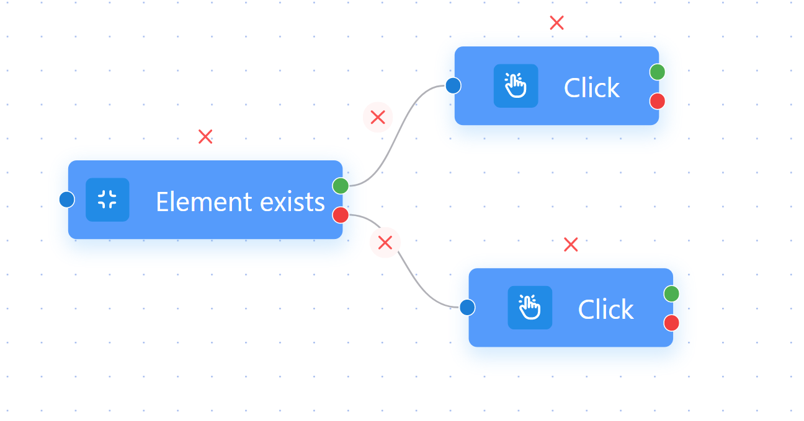

# AUTOMATION

Automation is a feature that helps you automate everything with just a few commands. It is suitable for repetitive or repetitive work processes with a large number of profiles such as register account, raise account, auto like, plow YouTube views, auto search to increase SEO,... and is created by articles created according to your ideas called scripts. Below is a complete tutorial on the Automation feature.

<figure><figcaption>
This is the main working screen of automation.
</figcaption></figure>

&#x20;But before you want to work with automation, you need to know how to can select element because It is necessary for most nodes to utilize it. You can open random URL and after that, click mouse right and click here : \

<figure><figcaption></figcaption></figure>

And choose exact element you want put in script like this :&#x20;

<figure><figcaption></figcaption></figure>

After that, you can see the blue lines in right tab like this :&#x20;

<figure><figcaption></figcaption></figure>

Continue clicking copy selector or copy xpath or full xpath. Normally you can copy selector but sometimes you have to copy full xpath, you can search when should I use either of them. If you have some understanding of inspect commands, selecting elements is easier without copying.

## SCRIPT

&#x20;Each script will be equivalent to one work cycle, in scripts containing "node" and there are always two cases for a node: red and green. Green is what you put in correctly and it continues to perform actions on other nodes, while red is incorrect. For some elements, you have to do both green and red :&#x20;

<figure><figcaption></figcaption></figure>

&#x20;             _<mark style="color:red;">in scripts use milliseconds and 1000 milliseconds = 1 second</mark>_ &#x20;

1. <mark style="color:red;">**Navigation**</mark><mark style="color:red;">:</mark> Nodes serve navigation actions

* **New tab**: when you use this node, the script will open a new tab to take the next action starts with URL you put in    &#x20;

<figure><figcaption></figcaption></figure>

* **Active tab:** if your profile starts with so many tabs so you can select the tab you want by title or URL and equal or contain some information you provide here&#x20;

<figure><figcaption></figcaption></figure>

* **Close tab:** You can choose close current tab or select tab if select tab you need to type tab number.

<figure><figcaption></figcaption></figure>

* **Reload page :** You can use it when you want the script to reload the page and set timeout waiting

<figure><figcaption></figcaption></figure>

* **Switch Frame:** Some pages have iframe and you have to use node Switch Frame to navigate. You have two choices Sub frame and main frame. If you choose a subframe you need to select the element of that frame and here you also set the timeout waiting.

<figure><figcaption></figcaption></figure>

* **Open url :** You just need to put URL you want here and set the timeout waiting&#x20;

<figure><figcaption></figcaption></figure>

* **Screenshot :** You can take a Screenshot you want when opening some URL or page and save to a folder you create in your PC.&#x20;
*

    <figure><figcaption></figcaption></figure>

2. <mark style="color:red;">**Mouse**</mark>

* **Click  :** True to its name, this button is used to automatically click the mouse on the element you select and put it in the "select element" box. In addition, it also has the option of left or right mouse click, middle click, click or double click and select by Selector or Coordinates

<figure><figcaption></figcaption></figure>

* **Scroll :** It is intended for users who wish to scroll the page to simulate an action or locate the next element they wish to manipulate by selecting element or by coordinates and you need to determine the coordinates of that location
*

    <figure><figcaption></figcaption></figure>
* **Mouse movement :** And you put the element you want to move mouse there.

<figure><figcaption></figcaption></figure>

* **Drop-down selector :** This Node is utilized when you need to choose a specific value given by people, such as selecting a date or month. Simply click on the desired value and a list of options will appear, such as selecting October 7th. You put an element into " select element" and type the value ( exemple : If you want to select July, enter the number 7 or you can import variables and choose to fill them based on them by clicking the orange button. )  you want in to " selected value".

<figure><figcaption></figcaption></figure>

3. <mark style="color:red;">**Keyboard**</mark>

* **Press key :**  This node allows you to select the desired key for the script to enter, similar to a keyboard.

<figure><figcaption></figcaption></figure>

* **Type text :** If you want the script to enter some text, you can pre-write it or choose a variable you include. For example, if you have a file, when you encounter a google search section, you will enter those words one by one, profile 1 fill in Hidemium, profile 2 fill in download Hidemium, etc. Or click on the orange button and it will let you choose the variables you entered in the node "read file" section that I will introduce below.&#x20;

<figure><figcaption></figcaption></figure>

* **Send text to selector :** The user can perform two actions simultaneously with this node. Click on the input box you want to send a piece of text to, such as email, password, or keyword, and refer to it as select element. And we talked above about how to get the correct selector. After, we need to enter a single content on one line; Please enter multiple content in a new line, and one of content will be random selected. Example :&#x20;

&#x20;    Content one

&#x20;    Content two

Or click on the orange button and it will let you choose the variables you entered in the node "read file" section that I will introduce below.

<figure><figcaption></figcaption></figure>

4. <mark style="color:red;">**DATA**</mark>

* **Element exists :** This function allows you to check whether the element you select exists or not. If it does not exist, you must have another node direction for it or the script is stopped here, but if it exists, it continues to follow direction you want. To verify whether a particular element exists, you have two options: you can either copy its selector or enter its formula in the designated box below. For example, if you need to check whether your email has an inbox button, this feature will help you determine its presence. If the button is missing, you can return to the login page and sign in again. If it's present, you can proceed to read your messages. When using this node, you must determine if two cases exist or not in order to create a professional script.

<figure><figcaption></figcaption></figure>

* **Get text :** You need to select an element and then the script will get the text value contained in that element and you need to set a name for that text data. For example, if you get the text 11/11/2000, you will set its Output Variable to the date of birth. And the Output Variable you must write in the orange Variable node on your work screen as soon as you open the script.

<figure><figcaption></figcaption></figure>

* **Get attribute value :**

<figure><figcaption></figcaption></figure>

* **File upload :** Please enter element in " select element" and choose selector type. Example you choose Local file or folder file random so you have to enter full path or upload file from your device and if you want to upload network file in element you selected so you need to enter link of that file. And setup timeout waiting is a finish step.

<figure><figcaption></figcaption></figure>

* **Write file :**&#x20;

<figure><figcaption></figcaption></figure>

* **Set variable :**

<figure><figcaption></figcaption></figure>

* **Converting JSON :**&#x20;

<figure><figcaption></figcaption></figure>

* **Extraction In Text :**&#x20;

<figure><figcaption></figcaption></figure>

* **Clear Cookies :** This node allows you to delete website cookies in your browser. Paste the link in the domain box or leave it blank to delete all cookies.

<figure><figcaption></figcaption></figure>

* **Get URL : T**his node allows you to get a domain or full URL or search key of website and you need to set a Output Variable for that.

<figure><figcaption></figcaption></figure>

* **Get value :** This node allows you take a value from element you put in here, and you need to set a Output Variable for that. Example : To extract the title of any video on YouTube, select the element that contains the title and assign it to the output variable "name". This will provide you with the title of the video as the end result.&#x20;

<figure><figcaption></figcaption></figure>

* **Random :**&#x20;

<figure><figcaption></figcaption></figure>

* **Read file :** this is an important node. To input your data, upload a text file. You can choose to arrange the data line by line or separated by a special character. If you select the latter option, you can also specify whether the script should randomly select certain lines or read each line in order and delete them as they are processed. Alternatively, you can leave these options blank. For sequential processing of each line without deletion, select the appropriate option above. When setting variables to map values, write the first value of the data, followed by the second value, and so on. For example, if you have Abc123@gmail.com|abc123|Xyz456@gmail.com, the format should be email|pass|recovery mail. Write each line separately, Like this :&#x20;

<figure><figcaption></figcaption></figure>

* **Authenticator Code**&#x20;

<figure><figcaption></figcaption></figure>

* **Download file**&#x20;

<figure><figcaption></figcaption></figure>

* **Set Cookies**

<figure><figcaption></figcaption></figure>

5. <mark style="color:red;">ORTHER</mark>

* **Pause :** This node allows you to pause for a specific time after any node and also set a random time delay.&#x20;

<figure><figcaption></figcaption></figure>

* **Eval :**&#x20;

<figure><figcaption></figcaption></figure>

* **For :** This node allows you to choose the type of loop: with data, with elements, or to repeat a certain action or process a certain number of times in the script.

<figure><figcaption></figcaption></figure>

* **Update profile :** To update your profile in the script, select this feature. You can change the name, status, tags, and add notes. This node functions as a filter after the script, and it is recommended to utilize the "element exist" node. Before adding the status in the script, make sure add the status column outside the main profile screen.&#x20;

<figure><figcaption></figcaption></figure>

* **If :**&#x20;

<figure><figcaption></figcaption></figure>

* **While :**&#x20;

<figure><figcaption></figcaption></figure>

* **Add comment :**  This node use on the script, you can marked each action one by one.Example, you can add comment with 3-4 nodes and that's write email. It seems like your script has a clear layout.

<figure><figcaption></figcaption></figure>

* **Stop Loop :** You can use this node to stop one Loop you want and it continue run the next nodes&#x20;

<figure><figcaption></figcaption></figure>

* **Run Other Script :** If you have created a script for a process before, you can add it to a new script to save time and just need to pick one.&#x20;

<figure><figcaption></figcaption></figure>

* **Disconnection :** You need to set the reconnection time when using the Disconnection node

<figure><figcaption></figcaption></figure>

<mark style="color:red;">**Conclude :**</mark> To easily utilize the automation feature with nodes, follow these instructions. Hidemium offers a safe and secure browser, as well as the ability to create various scripts for your work. If you have any questions or require assistance, please click [here ](https://t.me/hidemium)for support. Our goal is to help you achieve high performance at work, collaborate with you on discussing and suggesting anything you desire, and provide support in writing your own script if you purchase an expert or higher plan. Thank you for choosing Hidemium!

## CAMPAIGNS

## CREATE SCENARIOS
