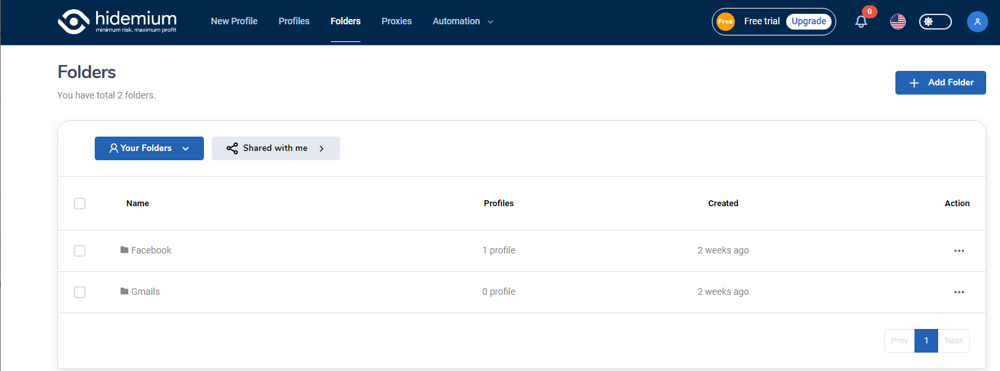

# FOLDERS

<figure><figcaption>
Folders
</figcaption></figure>

## Your folders

* Name: You can see the folder names that you've just created
* Profiles: The quantity of profiles that each folder contains
* Created: This field shows the date that you created the folder

## Users can have 3 more actions in this section:

* Share - Users can share the folder with other account
* Edit - Users can edit the Folder name here
* Delete - Users can delete any folders as you want

<figure><figcaption></figcaption></figure>

