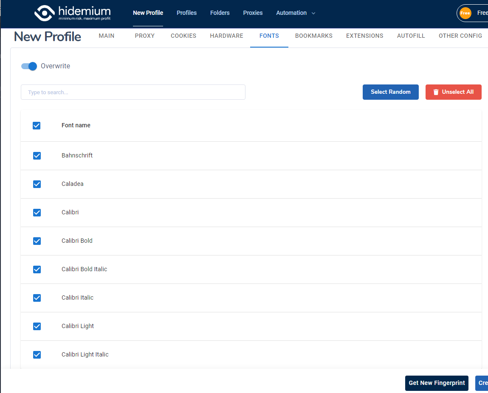

# FONTS

* If users turn of "Overwrite", Hidemium will use the default font in computer
* If users turn on "Overwrite", Hidemium will suggest some fonts for users&#x20;

<figure><figcaption>
Fonts
</figcaption></figure>
