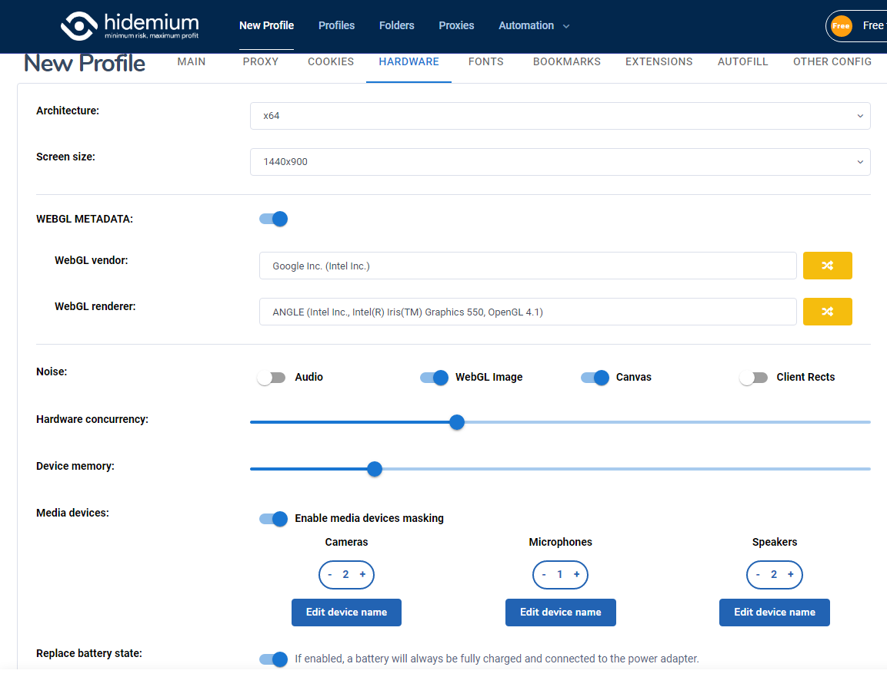

# HARDWARE

* Hidemium supports users to modify the Hardware's computer like Architecture, Screen size, WEBGL METADATA, Noise, Hardware concurrency, Device memory, Media devices, Replace battery state

<figure><figcaption>
Hardware
</figcaption></figure>
