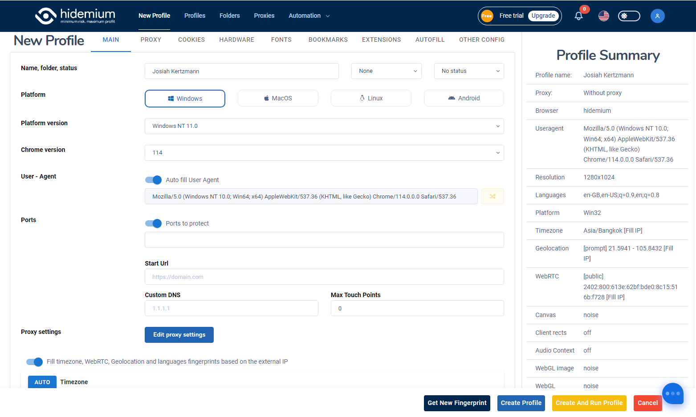
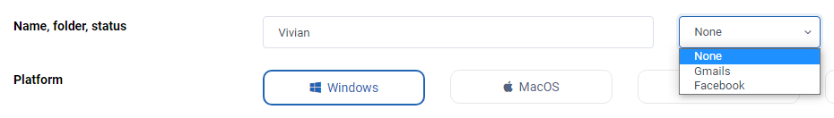
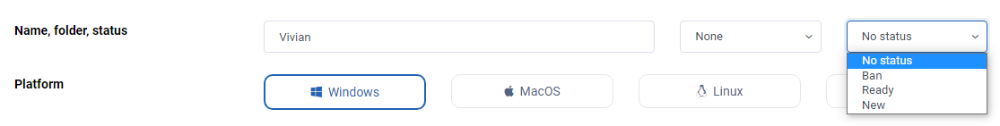
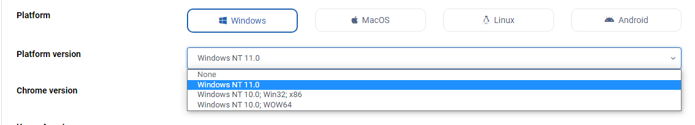
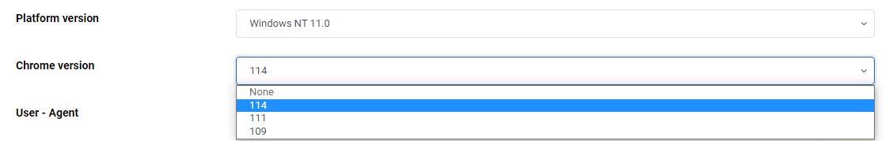
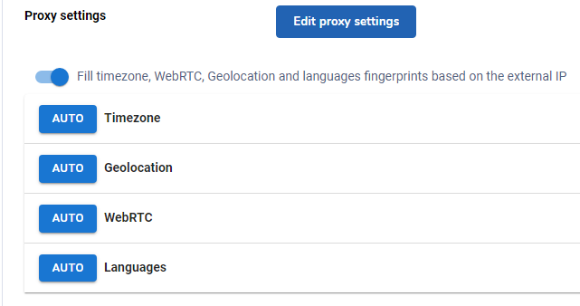
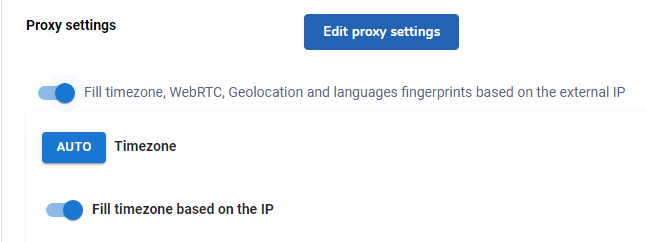
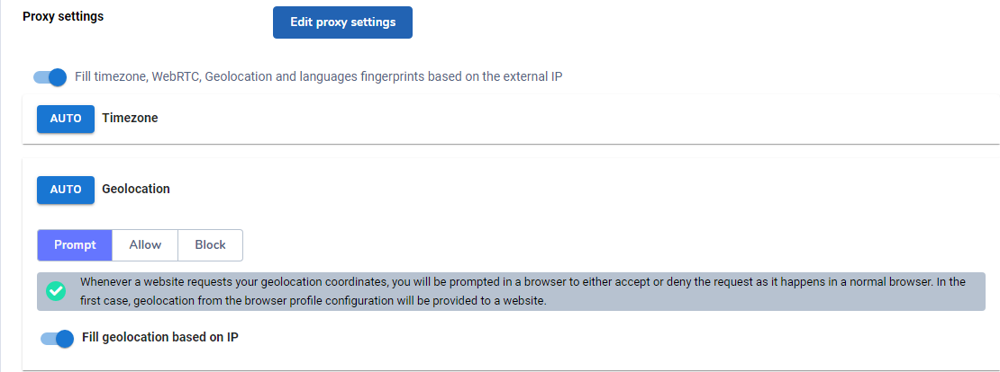
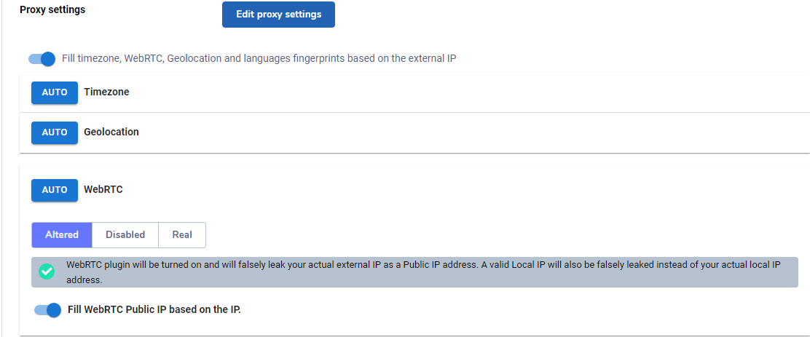
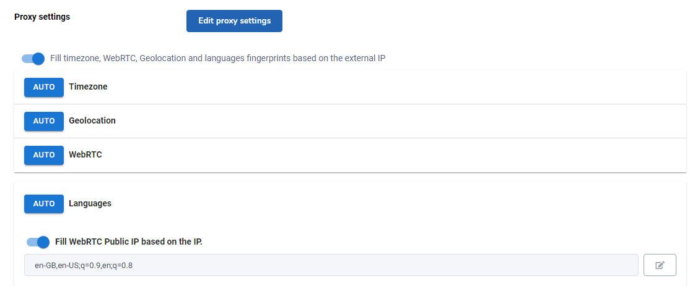

# MAIN

<figure><figcaption>
Main Section
</figcaption></figure>

## Name, folder, status:

* Name: You can set a new profile with a name
* Folder: You can choose a folder for the new profile
* Status: You can choose the status for the new profile as Ban - Ready - New

<figure><figcaption>
Name and Folder
</figcaption></figure>

 

<figure><figcaption>
Status
</figcaption></figure>

## Platform

* Windows&#x20;
* Mac OS&#x20;
* Linux&#x20;
* Android

## Platform version

You can choose the version of each Platform

<figure><figcaption>
Platform and Platform version
</figcaption></figure>

## Chrome version

You can choose the version of Chrome&#x20;

<figure><figcaption>
Chrome version
</figcaption></figure>

## User - Agent

You can choose Auto fill User Agent or Manual fill User Agent

## Ports

<figure><figcaption>
User Agent and Port
</figcaption></figure>

## Proxy settings

You can choose Timezone, WebRTC, Geolocation and Languages fingerprints based on the external IP or Set manually. You can check your proxy details including location, country, timezone.. by clicking Edit Proxy Setting button.

<figure><figcaption>
Proxy setting
</figcaption></figure>

### Timezone

This feature is the default, and you should follow Hidemium form because Timezone is based on the IP address or proxy you are using, which guarantees for browser profile. Besides, you can still manually enter the desired time zone without relying on the IP address or proxy.

* Timezone based on the external IP: You should leave this feature as default since Timezone will be based on IP address or proxy address, SOCKS that you are using. This will be best with the browser.
* Fill geolocation based on the external IP: This feature allows you to choose the timezone you want without relying on ip address, proxy, socks.

<figure><figcaption>
Timezone
</figcaption></figure>

### **Geolocation**

It is a feature that allows setting geolocation based on IP address and proxy. Geolocation also allows you to set your browser’s current location manually.&#x20;

* Prompt: This feature allows you to select the location you want based on IP address, proxy, socks or you can set the current location of the browser manually by turn off the "Fill geolocation based on IP"
* Allow: allows you to use the original location of your computer even when using a proxy or sock.
* Block:  a feature that blocks websites from reading your location from both the computer and the proxy.

<figure><figcaption>
Geolocation
</figcaption></figure>

### **WebRTC**

You should follow the default by Hidemium. It allows setting WebRTC parameters based on IP address and proxy or you can manually adjust the WebRTC address.

* Alter: This feature allows fake WebRTC based on proxy address, socks. You should leave this feature as default. Alter manual: The feature that allows you to set the WebRTC address manually.
* Disabled: Allows you to block websites from reading your webrtc address including your computer's network address and proxies, sock.
* Real: Use your computer's Webrtc address even if you use a proxy, sock.

<figure><figcaption>
WebRTC
</figcaption></figure>

### Languages

* Fill WebRTC Public IP based on the IP: This feature allows you to choose the WebRTC Public IP you want relying on IP address, proxy, socks.

<figure><figcaption>
Languages
</figcaption></figure>

