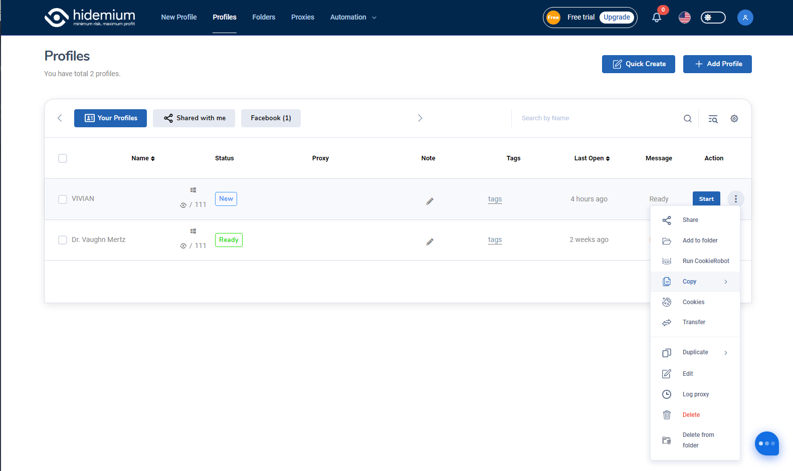

# PROFILES

## Your Profiles

Name: This shows all profile names that you created

Status: This shows status for all profiles that you chose when you created new profile

Proxy: This shows all Proxies that you chose when you created profile

Note: You can click to “Pen” icon to fill in your notices

Tags: You can assign profiles with 1 tag, which can help you to be easier access to your desired profile just by entering the tag

Last open: This shows the latest time that you used the profile

Message: This shows the status of each profile

Action: If you want to use the profile you click “Start” button&#x20;

<figure><figcaption>
Your Profiles
</figcaption></figure>

### You can click … to see more functions

* Share: You can share the profile with the other by adding their mail
* Add to Folder: You can add the profile to the Folder that you can manage easily
* Run CookieRobot:
* Copy:
* Cookies:
* Transfer: You can transfer the profile to another account to manage it
* Duplicate: You click here to have one more profile that is the same with the original one
* Edit: You click here to modify the profile
* Long proxy:&#x20;
* Delete: You click here to delete the profiles&#x20;
* Delete from Folder: You click here to delete profiles from the folder

<figure><figcaption>
More functions
</figcaption></figure>

## Shared with me

You can see the profiles which are shared with you account by click to "Shared with me" button, if there isn't any shared profiles, it will show "Data is empty"

<figure><figcaption>
Shared with me
</figcaption></figure>
