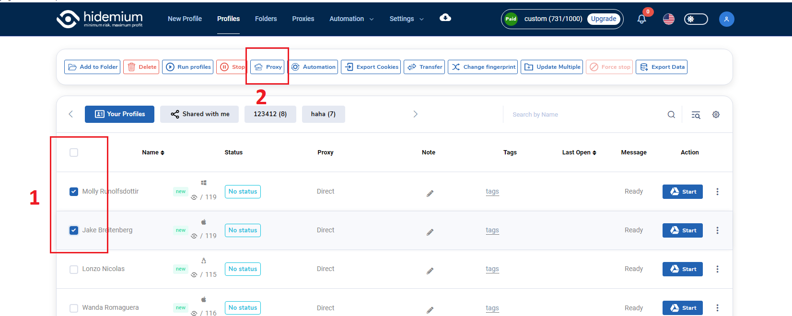

# Change Proxy

Khi muốn thay đổi proxy cho nhiều profile cùng lúc, ta có thể chọn chức năng này. Đầu tiên bạn chọn các profile cần thêm proxy, sau khi chọn xong sẽ xuất hiện menu bên trên, bạn chọn proxy.

<figure><figcaption></figcaption></figure>

Popup change proxy hiện lên, bạn có thể nhập proxy mà bạn muốn thêm vào profiles tại đây, các type proxy là SSH, HTTP, SOCKS4, SOCKS5:

<figure><figcaption></figcaption></figure>

Bạn cũng có thể chọn nhiều proxy trong danh sách proxy của bạn tại đây:

<figure><figcaption></figcaption></figure>
