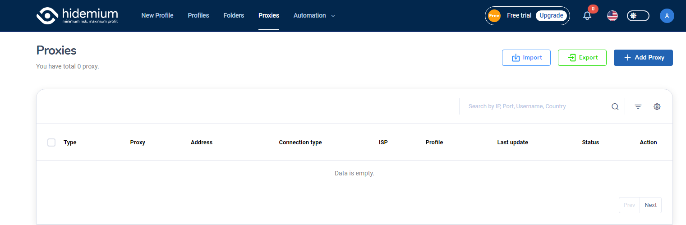

# PROXIES

Hidemium is more convenient when developing a batch proxy management tool.

* Import proxy:&#x20;
* Export proxy:  Hidemium also supports downloading the proxy list on the software with the Export feature in the Proxies section.
* Add proxy: Once you have entered the list of proxies, you can return to the Profiles section to select the Profile you want to add a proxy to (as introduced in the New Profile > Proxy section above).
*

    <figure><figcaption>
Proxy
</figcaption></figure>
