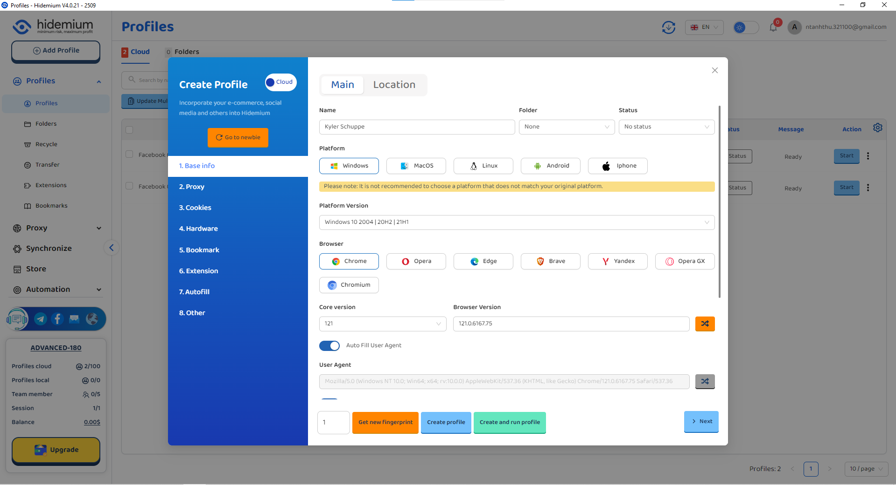

# 代理

用户可以批量导入-导出和管理代理

Hidemium使在开发理代理管理工具更方便。

导入代理：

导出代理：Hidemium还支持在“代理”部分中使用“导出功能”下载软件上的代理列表。

添加代理：输入代理列表后，您可以返回“资料”部分，以选择要添加代理的资料（如以上新的资料>“代理”部分中的介绍）

<figure><figcaption></figcaption></figure>
