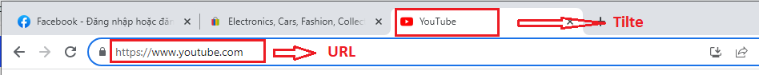

# 账号

**Cloud**

名称：显示您创建的所有资料名称

状态：显示您在创建新资料时选择的所有资料的状态

代理：显示您在创建资料时选择的所有代理

备注：您可以单击“笔”图标填写通知

标签：您可以为资料分配 1 个标签，这可以帮助您只需输入标签即可更轻松地访问所需的资料

最近打开：显示您使用资料的最近时间

消息：显示每个账号资料的状态

操作：如果您想使用账号资料，请单击“开始”

<figure><figcaption></figcaption></figure>

**您可以单击...查看更多功能**

分享：您可以通过添加邮件与其他人共享账号资料

添加到文件夹：您可以将资料添加到您可以轻松管理的文件夹中

运行 CookieRobot：

复制：

Cookie：

转移：您可以转移资料到另一个帐户进行管理

复制：您单击此处可获得与原本资料相同的另一个资料 编辑：您单击此处修改资料

长代理：

删除：您单击此处删除资料

从文件夹删除：您单击此处从文件夹中删除资料

<figure><figcaption></figcaption></figure>

**与我分享**&#x20;

您可以通过单击“与我分享”按钮查看与您的帐户共享的资料，如果没有共享的资料，它将显示“数据为空”
